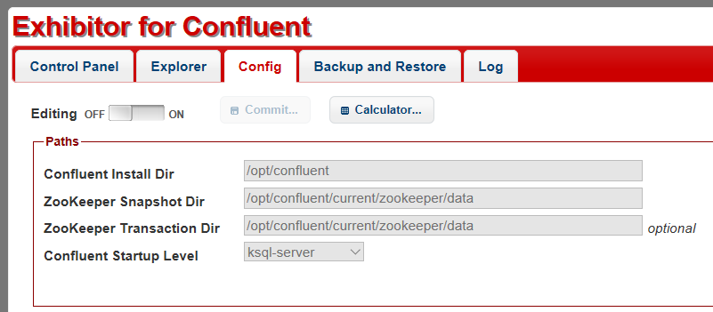

## DESCRIPTION
Exhibitor is a supervisor system for Apache ZooKeeper (http://zookeeper.apache.org/).

Exhibitor4Confluent is ready to use in cluster nodes of Confluent-Platform.

## DETAILS

Latest repository files are at https://github.com/soabase/exhibitor
Please see the doc at https://github.com/Netflix/exhibitor/wiki

## BUILDING

Exhibitor is built via Maven (https://maven.apache.org/).  
To build do `mvn install`.

## AUTHOR

Taner Ari (tanerari@yahoo.com)

## LICENSE

Copyright 2012 Netflix, Inc.

Licensed under the Apache License, Version 2.0 (the “License”); you may not use this file except in
compliance with the License. You may obtain a copy of the License at

http://www.apache.org/licenses/LICENSE-2.0
Unless required by applicable law or agreed to in writing, software distributed under the License is
distributed on an “AS IS” BASIS, WITHOUT WARRANTIES OR CONDITIONS OF ANY KIND, either express or
implied. See the License for the specific language governing permissions and limitations under the
License.
